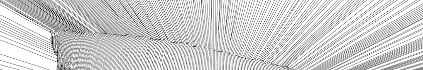
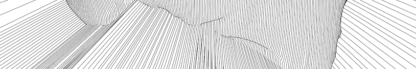
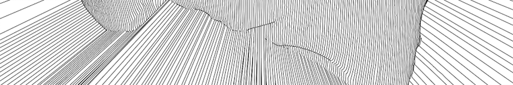

<!-- -->

<!-- 
   -->
<!---->

   

<h1 align="center" style=" border-bottom: none ;">Pre-Course Portfolio  ARCH470 </h1>
<!--<h3 align="center" style="font-style: italic;font-size:2em;">  ARCH 470 </h3>-->

<!-- 
  -->
  
  

   

<!---->

  
  

  
  

<h2 align="center"> Vertical Plotter "Polargraph" </h2>

&nbsp;&nbsp;&nbsp;&nbsp;&nbsp;&nbsp;This is a simple device, that draws pictures using a normal pen, some stepper motors and a belt. It is slow and noisy, but its enough to get the job done. It is called polargraph because it uses dual-polar coordinates system internally, rather than regular cartesian system we tend to use in 3d printers and plotters. This version is designed and built by me, but the idea of vertical plotter (HEKTOR) goes all the way back to 2002. Hektor is a portable spray paint output device for computers. It was created in collaboration with engineer Uli Franke for Jürg Lehni's diploma project at ECAL (École cantonale d'art de Lausanne).
  For more information you can visit <a href="https://www.ozgurgulsuna.com/polargraph"> ozgurgulsuna.com/polargraph</a>.

    
    
    

    
    
    
    

    
    
      
    

<h3 align="center">The Myth of the Singular Moment Exhibition, METU 2019</h3>

 
  &nbsp;&nbsp;&nbsp;&nbsp;&nbsp;&nbsp;Nowadays, technology's interference in our lives is increasing, which disturbs the definitions we got used to. As an example, the algorithms which compete with each other to achieve the perfect photographs, unintentionally change the limits of the “perfect” photo definition...
  

    
    

    
    &nbsp;
    

    
    &nbsp;
    

<h3 align="right"><em> Middle East Technical University, Ankara</em> </h3>

  

<h2 align="center"> Topology Optimization</h2>

&nbsp;&nbsp;&nbsp;&nbsp;&nbsp;&nbsp;Optimizing the geometry for a specific goal using computational tools is a technique that results in unforeseen outputs. The finite element method, which is generally applied in order to solve this problem, generates organic models. This resembles the evolutionary optimization of nature itself. Thus generated models have similarities with bones and plants. I used this technique in two mini-projects, first one is a shelf bracket-like design for my desk support and second one is a door stop.

    
    
    

Shelf Bracket&nbsp;&nbsp;&nbsp;&nbsp;&nbsp;&nbsp;&nbsp;&nbsp;

    
     &nbsp;
    

Door Stop&nbsp;&nbsp;&nbsp;&nbsp;&nbsp;&nbsp;&nbsp;&nbsp;

  

<h2 align="center"> PHOTOGRAPHY Alternative Processes</h2>

&nbsp;&nbsp;&nbsp;&nbsp;&nbsp;&nbsp;I have been interested in photography for only a couple of years, but my previous works were deeply related to pointing at and shooting something. I like to work with mechanical cameras and develop my visuals in a darkroom. This hands-on procedure can be limiting, but restrictions open up a new perspective for one. I believe that darkroom printing practice has beauty in both the process and the detail/lifetime of visuals. Below you can find examples of silver prints from an old exhibition of mine.

<h3 align="center">Photography Exhibition Ankara, May 2018</h3>

    
    &nbsp;
    

    
    &nbsp;
    

<h3 align="right"><em>For more information, please contact</em> </h3>

<h3 align="center">GumBichromate Online Exhibition, 2020</h3>

&nbsp;&nbsp;&nbsp;&nbsp;&nbsp;&nbsp;Gum bichromate is a photographic printing process. The image is rendered on any fibrous material from the negatives more than once. This multi-layer process, which is essential for color prints. I have been exploring the procedure for a couple of years now, and it yielded these results. 
  

    
    

    
    
    

<h3 align="right"><em><a  href="http://aft.metu.edu.tr/portfolio.php?id=ozgur">Exhibiton can be visited here</a></em> </h3>

<h2 align="center"> Unlisted</h2>

&nbsp;&nbsp;&nbsp;&nbsp;&nbsp;&nbsp;Optimizing the geometry for a specific goal using computational tools is a technique that results in unforeseen outputs. Finite element method, which is generally applied in order to solve this problem generates organic models. This resembles the evolutionary optimization of the nature itself, thus generated models have similarities with bones and plants. I used this technique in two mini projects, first one is a shelf bracket like design for my desk support and second one is a door stop.

    
    
    

    
    
    

    
    
    

